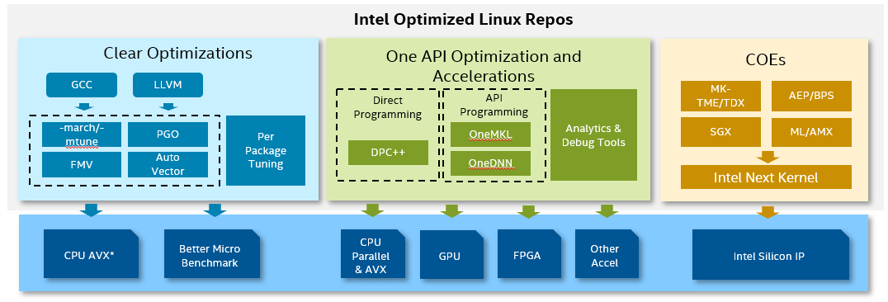

# Intel Linux CentOS Repository

This repository includes all Intel optimized packages on CentOS Stream. These optimizes are collected from ClearLinux, OneAPI or other COE projects.



## How To Use

### List Packages
```
./pkg.sh list [-r <repo_dir> ]
```
* `-r <repo_dir>` is optional, by default the repository directory is the "repo" folder under this projects

### Build Packages

#### Prerequisites:

The build is executed in a mock docker container, so you just need an Linux environment, not limited to any distro. Ubuntu, CentOS or ClearLinux are all OK.

The only prerequisites is docker engine. 

_NOTE: Since the data folders like cache, build, result was seperated customizable and stateless, so whole build can be easily deployed on kubernetes based cloud native build framework._

#### Initialize mock build container
```
cd tools/mock-build-docker
./build-container.sh
```

#### Build a package
```
./pkg.sh build -p <package_name> [ -r <repo_dir>]
```
* `-p <package_name>` Specify the package name for build, please use `./pkg.sh list` to find the package for build
* `-r <repo_dir>` is optional, by default the repository directory is the "repo" folder under this projects

For example:
```
./pkg.sh build -p glibc-intel-avx
```

After build,
- Original upstream rpm at ./build/<package_name>
- Optimized srpm and rpms at ./build/<package_name>/result/

_NOTE: mock's cache and ccache are under ./cache folder, please configure temporary storage when building on kubernetes CI/CD_